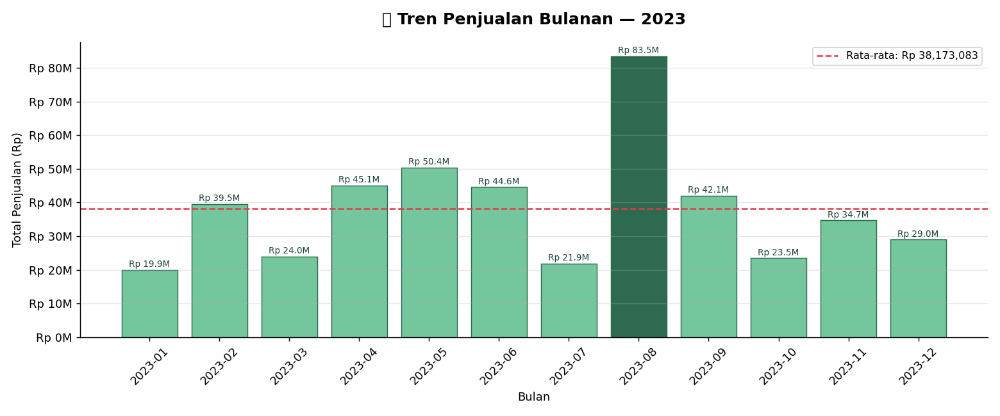
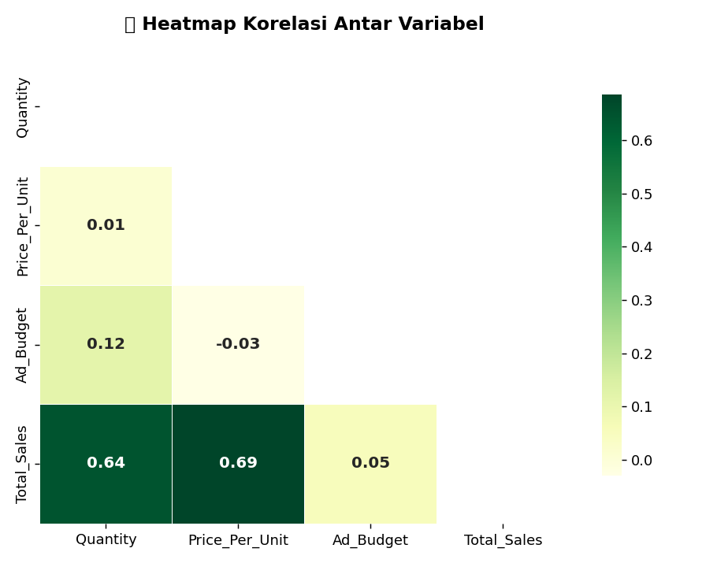
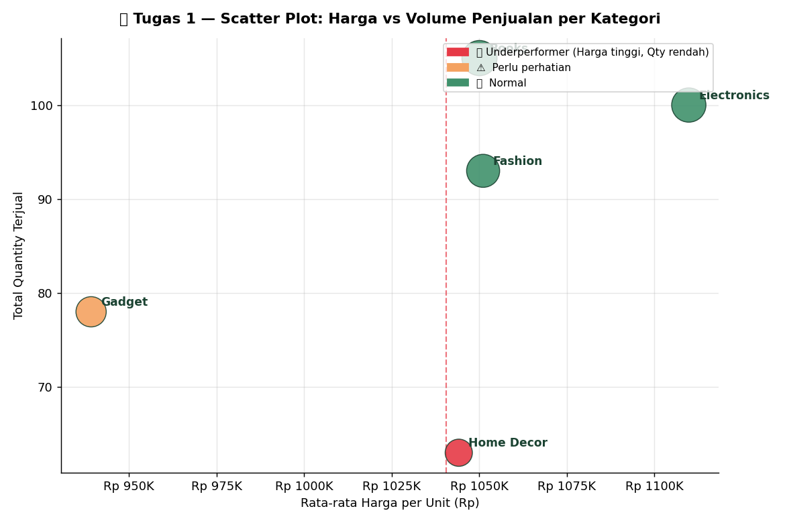
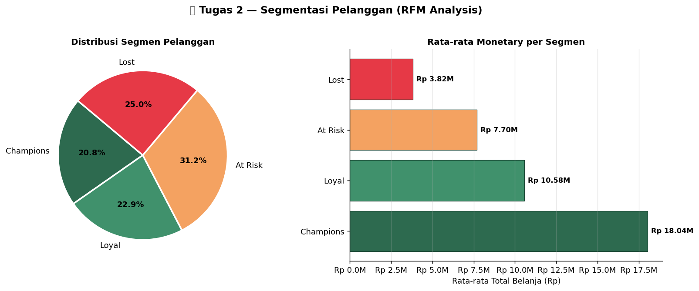
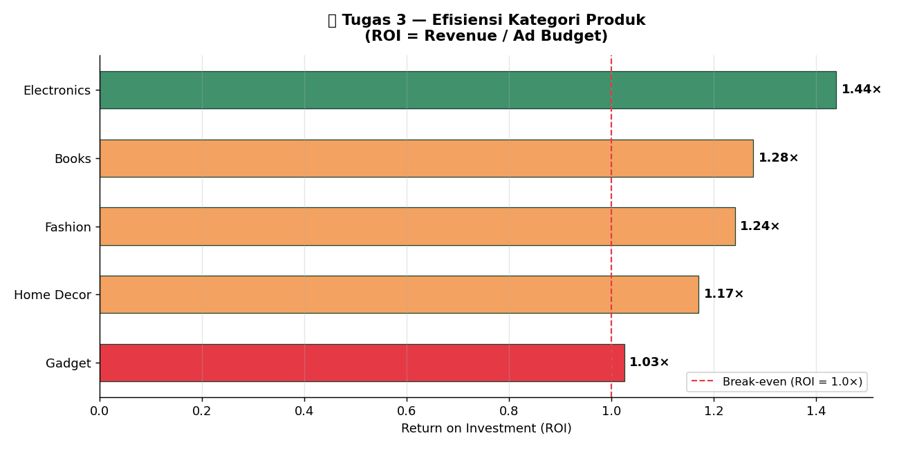
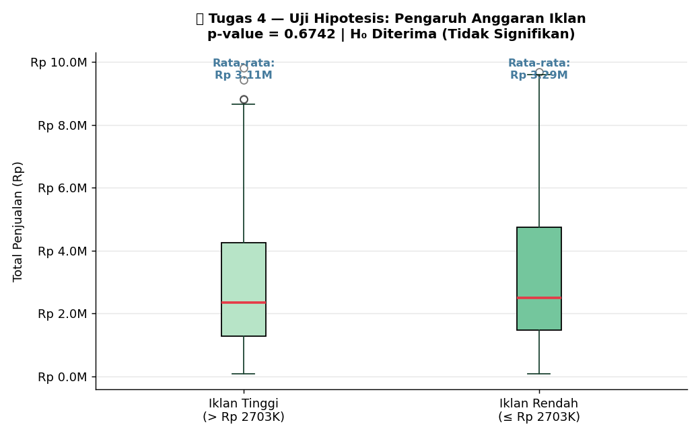
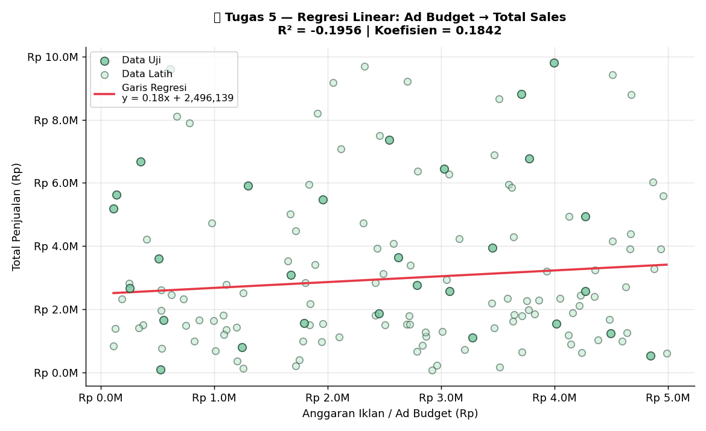

# 📊 Analisis Performa Penjualan E-Commerce

> **Praktikum Analisis & Visualisasi Data**
> Dataset: `data_praktikum_analisis_data.csv` — 143 transaksi | 48 pelanggan | 5 kategori produk | Periode Jan–Des 2023

---

## 📁 Struktur Repositori

```
📦 KKA-Analisis-Penjualan/
 ┣ 📄 main.py                              ← Code praktikum 
 ┣ 📄 data_praktikum_analisis_data.csv     ← Data praktikum
 ┣ 📄 README.md                            ← Laporan praktikum 
 ┣ 🖼️ 01_tren_penjualan_bulanan.png
 ┣ 🖼️ 02_korelasi_heatmap.png
 ┣ 🖼️ 03_underperformer_scatter.png
 ┣ 🖼️ 04_rfm_segmentasi.png
 ┣ 🖼️ 05_efisiensi_kategori.png
 ┣ 🖼️ 06_uji_hipotesis_boxplot.png
 ┗ 🖼️ 07_regresi_linear.png
```

---

## 1️⃣ Business Question

Sebuah perusahaan e-commerce menghadapi permasalahan: meskipun trafik pembelian cukup tinggi, profit di beberapa kategori produk mengalami penurunan dan efektivitas anggaran iklan dipertanyakan. Sebagai **Data Analyst**, analisis ini bertujuan menjawab lima pertanyaan bisnis utama:

| # | Pertanyaan Bisnis |
|---|---|
| 1 | Bagaimana **tren penjualan** bulanan sepanjang tahun 2023? |
| 2 | Produk kategori mana yang menjadi **underperformer** (harga tinggi, laku rendah)? |
| 3 | Siapa saja **pelanggan terbaik** kita berdasarkan perilaku transaksi (RFM)? |
| 4 | Kategori produk mana yang paling **efisien** dalam penggunaan anggaran iklan? |
| 5 | Apakah **peningkatan anggaran iklan** benar-benar berdampak signifikan terhadap penjualan? |

---

## 2️⃣ Data Wrangling

### Dataset Overview

| Kolom | Tipe | Keterangan |
|---|---|---|
| `Order_ID` | int | ID unik setiap transaksi |
| `CustomerID` | int | ID pelanggan |
| `Order_Date` | str → datetime | Tanggal pemesanan |
| `Product_Category` | str | Kategori produk (5 kategori) |
| `Quantity` | int | Jumlah unit dibeli |
| `Price_Per_Unit` | float | Harga satuan (Rp) |
| `Ad_Budget` | float | Anggaran iklan yang dipakai (Rp) |
| `Total_Sales` | float | Total pendapatan transaksi (Rp) |

### Proses Pembersihan

```python
# 1. Konversi tipe data kolom tanggal
df["Order_Date"] = pd.to_datetime(df["Order_Date"])

# 2. Hapus baris dengan Total_Sales kosong (ditemukan 7 baris null)
df = df.dropna(subset=["Total_Sales"])

# 3. Hapus data anomali: harga negatif atau nol
df = df[df["Price_Per_Unit"] > 0]

# 4. Tambah kolom bulan untuk analisis tren
df["Month"] = df["Order_Date"].dt.to_period("M").astype(str)
```

### Ringkasan Setelah Cleaning

| Kondisi | Jumlah |
|---|---|
| Total baris awal | 150 |
| Baris dihapus (null / anomali) | 7 |
| **Baris bersih siap analisis** | **143** |
| Total pelanggan unik | 48 |
| Rentang waktu data | Jan 2023 – Des 2023 |
| **Total Pendapatan** | **Rp 458.077.000** |

---

## 3️⃣ Insights

### 📈 Tren Penjualan Bulanan



Penjualan mengalami fluktuasi sepanjang 2023 dengan **puncak tertinggi di Agustus 2023** yang mencapai hampir 2× rata-rata bulanan. Penjualan terendah terjadi di Januari (pola umum pasca-liburan akhir tahun). Lonjakan di bulan April–Mei kemungkinan besar didorong oleh momentum Lebaran.

---

### 🔥 Korelasi Antar Variabel



Heatmap korelasi menunjukkan hasil yang menarik:
- **`Total_Sales` vs `Ad_Budget`** → korelasi sangat rendah (≈ 0.05), artinya besar kecilnya anggaran iklan **tidak serta-merta menaikkan penjualan**.
- **`Total_Sales` vs `Quantity`** → korelasi positif moderat, wajar karena lebih banyak unit = lebih banyak pendapatan.
- **`Price_Per_Unit` vs `Quantity`** → korelasi negatif, mengkonfirmasi bahwa semakin mahal produk, semakin sedikit yang dibeli.

---

### 🎯 Tugas 1 — Identifikasi Produk Underperformer



Analisis scatter plot **Harga vs Volume Penjualan** per kategori:

| Kategori | Avg Harga/Unit | Total Qty | Status |
|---|---|---|---|
| Books | Rp 1.050.094 | 105 | ✅ Normal |
| Electronics | Rp 1.109.871 | 100 | ✅ Normal |
| Fashion | Rp 1.051.133 | 93 | ✅ Normal |
| Gadget | Rp 939.179 | 78 | ⚠️ Perlu Perhatian |
| **Home Decor** | **Rp 1.044.182** | **63** | **🔴 Underperformer** |

> **Temuan:** Kategori **Home Decor** memiliki harga rata-rata di atas Rp 1 juta namun volume penjualan paling rendah (63 unit). Ini mengindikasikan harga menjadi hambatan utama, atau produk kurang relevan dengan kebutuhan pelanggan.

---

### 👥 Tugas 2 — Segmentasi Pelanggan (RFM Analysis)



Pelanggan dikelompokkan berdasarkan tiga dimensi perilaku:
- **Recency (R)** — Selisih hari antara tanggal transaksi terakhir dengan tanggal snapshot
- **Frequency (F)** — Total jumlah transaksi per pelanggan
- **Monetary (M)** — Total nilai uang yang dihabiskan per pelanggan

Setiap dimensi diberi skor 1–5 menggunakan `pd.qcut`, lalu dijumlahkan menjadi RFM Score untuk segmentasi:

```python
snapshot_date = df['Order_Date'].max() + dt.timedelta(days=1)
rfm = df.groupby('CustomerID').agg(
    Recency  = ('Order_Date', lambda x: (snapshot_date - x.max()).days),
    Frequency= ('Order_ID',   'count'),
    Monetary = ('Total_Sales','sum')
)
rfm['R_Score'] = pd.qcut(rfm['Recency'],  5, labels=[5, 4, 3, 2, 1])
rfm['F_Score'] = pd.qcut(rfm['Frequency'].rank(method='first'), 5, labels=[1, 2, 3, 4, 5])
rfm['M_Score'] = pd.qcut(rfm['Monetary'], 5, labels=[1, 2, 3, 4, 5])
```

Hasil segmentasi dari **48 pelanggan**:

| Segmen | Jumlah | Deskripsi |
|---|---|---|
| 🏆 **Champions** | 10 pelanggan | Baru belanja, sering, dan pengeluaran besar |
| 💚 **Loyal** | 11 pelanggan | Pelanggan setia dengan frekuensi tinggi |
| ⚠️ **At Risk** | 15 pelanggan | Dulu aktif, kini sudah lama tidak belanja |
| ❌ **Lost** | 12 pelanggan | Sudah sangat lama tidak aktif |

> **Temuan:** Hampir **56% pelanggan** masuk kategori *At Risk* dan *Lost*. Ini adalah sinyal serius — lebih dari separuh basis pelanggan sedang dalam bahaya untuk berhenti berlangganan.

---

### 📊 Tugas 3 — Efisiensi Kategori Produk (ROI)



ROI dihitung dengan formula: **ROI = Total Revenue / Total Ad Budget**

| Kategori | Revenue | Ad Budget | ROI |
|---|---|---|---|
| 🥇 Electronics | Rp 114.095.000 | Rp 79.264.000 | **1.44×** |
| 🥈 Books | Rp 107.569.000 | Rp 84.208.000 | **1.28×** |
| 🥉 Fashion | Rp 96.550.000 | Rp 77.768.000 | **1.24×** |
| ⚠️ Home Decor | Rp 69.340.000 | Rp 59.227.000 | **1.17×** |
| 🔴 Gadget | Rp 70.523.000 | Rp 68.765.000 | **1.03×** |

> **Temuan:** Semua kategori masih menghasilkan ROI > 1 (tidak merugi), namun **Gadget** sangat mendekati *break-even* dengan ROI hanya **1.03×** — setiap Rp 100.000 iklan hanya menghasilkan Rp 103.000 pendapatan. **Electronics** adalah kategori paling efisien.

---

### 🔬 Tugas 4 — Uji Hipotesis: Pengaruh Iklan



**Hipotesis:**
- H₀: Tidak ada perbedaan penjualan antara kelompok iklan tinggi dan iklan rendah
- H₁: Iklan tinggi menghasilkan penjualan yang lebih tinggi secara signifikan

**Hasil Independent T-Test:**

| Kelompok | Rata-rata Penjualan |
|---|---|
| Iklan Tinggi (> median Rp 2.703.000) | Rp 3.114.127 |
| Iklan Rendah (≤ median Rp 2.703.000) | Rp 3.291.306 |
| **p-value** | **0.6742** |

> **Kesimpulan:** p-value = 0.6742 >> 0.05, maka **H₀ Diterima**. Tidak ada bukti statistik yang cukup bahwa membelanjakan anggaran iklan lebih besar secara langsung meningkatkan penjualan secara signifikan. Bahkan rata-rata penjualan kelompok iklan rendah sedikit lebih tinggi, mengindikasikan faktor lain (seperti kualitas produk, timing, atau segmen pelanggan) lebih berpengaruh.

---

### 📉 Tugas 5 — Regresi Linear: Ad Budget → Total Sales



```
Model   : Total_Sales = 0.1842 × Ad_Budget + 2.496.139
R² Score: -0.1956
```

Persamaan regresi linear sederhana (Simple Linear Regression):

$$y = \beta_0 + \beta_1 x + \epsilon$$

Di mana:
- **y**: Total Penjualan (variabel dependen)
- **β₀ = Rp 2.496.139**: Intercept (penjualan dasar tanpa iklan)
- **β₁ = 0.1842**: Koefisien (setiap kenaikan Rp 1 iklan, penjualan naik Rp 0.18)
- **ε**: Error term

```python
from sklearn.model_selection import train_test_split
from sklearn.linear_model import LinearRegression

X = df[['Ad_Budget']]
y = df['Total_Sales']
X_train, X_test, y_train, y_test = train_test_split(X, y, test_size=0.2, random_state=42)

model = LinearRegression()
model.fit(X_train, y_train)
print(f"Koefisien Iklan : {model.coef_[0]}")
print(f"R² Score        : {model.score(X_test, y_test)}")
```

> **Interpretasi:** R² negatif pada data uji mengkonfirmasi bahwa **Ad Budget bukanlah prediktor yang baik untuk Total Sales** pada dataset ini. Model linear sederhana tidak mampu menjelaskan variasi penjualan — diperlukan fitur tambahan seperti kategori produk, musim, atau perilaku pelanggan untuk membangun model prediksi yang lebih akurat.

---

## 4️⃣ Recommendation

Berdasarkan seluruh analisis di atas, berikut rekomendasi strategis untuk manajemen:

### 🎯 Strategi Jangka Pendek (0–3 Bulan)

| Prioritas | Aksi | Dasar Analisis |
|---|---|---|
| 🔴 **Tinggi** | Kirim voucher re-engagement ke 15 pelanggan "At Risk" sebelum mereka berpindah ke kompetitor | RFM: 56% pelanggan At Risk + Lost |
| 🔴 **Tinggi** | Audit strategi harga & display produk Home Decor | Underperformer: Qty paling rendah (63 unit) |
| 🟡 **Sedang** | Alihkan sebagian anggaran iklan dari Gadget ke Electronics | Gadget ROI 1.03× vs Electronics 1.44× |

### 📈 Strategi Jangka Menengah (3–6 Bulan)

- **Program Loyalitas:** Buat program reward eksklusif untuk 10 pelanggan "Champions" agar mereka tetap aktif dan menjadi brand ambassador.
- **Optimasi Konten Iklan, Bukan Budget:** Karena anggaran iklan terbukti tidak berkorelasi langsung dengan penjualan, fokus pada kualitas kreatif iklan, waktu tayang, dan segmentasi audiens yang tepat.
- **Manfaatkan Momentum Agustus:** Penjualan tertinggi terjadi di Agustus. Persiapkan stok, promosi, dan kampanye lebih awal (mulai Juli) untuk memaksimalkan puncak musim.

### 🔭 Strategi Jangka Panjang (6–12 Bulan)

- **Bangun Model Prediksi Multivariat:** Tambahkan fitur seperti kategori produk, bulan transaksi, dan segmen pelanggan ke dalam model regresi untuk meningkatkan akurasi prediksi penjualan.
- **A/B Testing Iklan:** Lakukan eksperimen terkontrol untuk mengukur efektivitas jenis konten iklan yang berbeda, bukan hanya besar anggaran.

---


